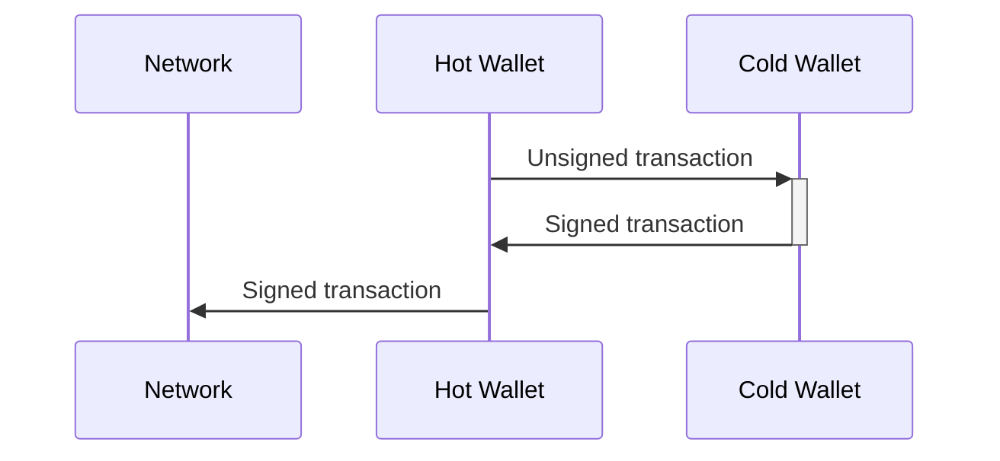
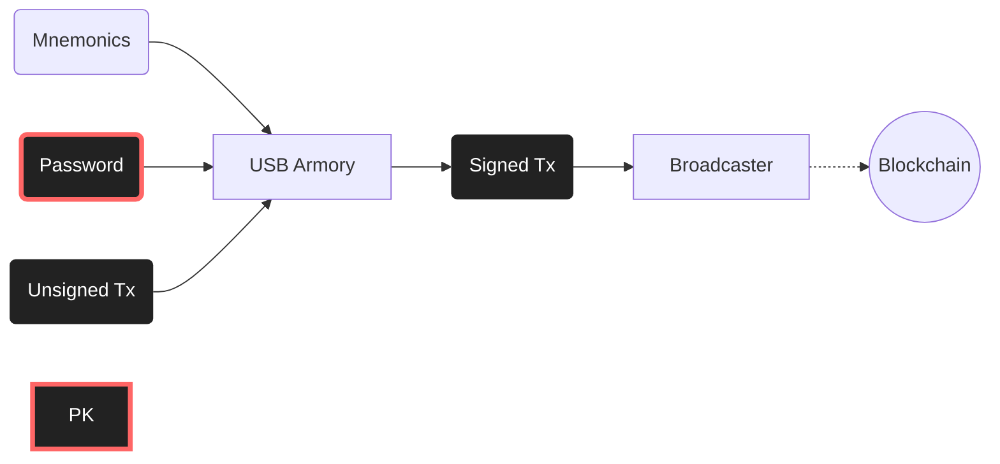

# Signer tutorial

## Introduction

In order to receive and send Bitcoins, a user has to possess a *bitcoin wallet*. Every bitcoin wallet can be managed by anyone who has the *private key* of that wallet. A private key is a 256-bit number that enables the user to manage *all assets* associated with that wallet. 

Every private key can be used for the derivation of thousands of Bitcoin addresses associated with that private key. Bitcoin address is a public piece of information and can be shared freely. Any asset sent to any of these addresses can be used in new transactions if and only if those transactions are signed by the private key. Therefore, it is of crucial importance for the private key to stay private.

Often, a private key is stored on a personal computer or a server. In those cases, the user can easily manage assets because appropriate software can read private key, create and sign transactions via that private key. Software that is used for creating and signing transactions and managing private keys is also called *wallet*.

Storing a private key on a personal computer or server represents a huge security problem because anyone who accesses that computer/server can manage all assets (ie. it can spend all bitcoins). Many viruses and hacker attacks today are trying to find private keys on the compromised device. 

To prevent an attacker from accessing private keys, a type of wallet called a *cold wallet* is used. With the cold wallet, the private key is stored on a device that is offline (cold). When the user wants to sign a transaction, he or she creates an unsigned transaction (via software on the computer that is connected to the internet), transfers the transaction to the cold storage device where that transaction is signed via private key, and then returns signed transaction back to the software from which transaction is broadcasted (hot wallet software, like Electrum, can be used for loading signed transactions and broadcasting them):



Most cold wallets come in form of USB devices. When the user wants to sign a transaction, the cold wallet is connected to the personal computer. Appropriate software takes care of all communication between the user and the cold wallet, and the user can easily create new transactions. Often, the USB device has physical buttons or a touch screen that enables the user to enter the password. Password is used for encrypting private keys and represents one more layer of security.

Unfortunately, the moment a cold wallet is connected to a desktop, it is exposed to threats. Theoretically, an attacker that has access to the desktop could extract the private key from the connected cold wallet (note that by design cold wallet should never expose the private key).

The *Blind signer* project intends to produce a cold wallet that can sign transactions without the connection of wallet to the host device. The Blind signer project is realized on a device called *USB Armory II*. USB Armory is a computer in form and size of a USB stick (also, on stick there is a μSD slot). Blind signer project is software intended to be run on USB Armory. The sole purpose of this software is to sign transactions with a private key. Unlike other cold wallets, Blind signer doesn't have to be connected to a personal computer to work. Instead, an unsigned transaction is provided via a single μSD card, and another μSD card is used to transfer the signed transaction from the USB Armory to the device that can broadcast the transaction to the network. In this way, the attack surface is non-existent, but the act of signing the transaction isn't any more convenient as with other solutions (with Blind signer, the whole process of singing can take ~10 minutes, while with other solutions it is a matter of seconds).

Thanks to [BIP39], the private key can be generated from the list of ~dozen English words. Those words are selected from [the predefined list](https://github.com/bitcoin/bips/blob/master/bip-0039/english.txt) of 2048 words. Selection of dozen words that generates some private key is called *mnemonics* of that key. Often, private key is not generated directly from mnemonics, but from mnemonics and one arbitrary word called *password*. Therefore, anyone who poses mnemonics and password also posses private key! It is also good to know that mnemonics nor password can't be extracted from from private key.

Blind signer doesn't store private key on USB Armory. Instead, private key is derived from the mnemonics and password every time the signer is used. Mnemonics and password are stored on separate μSD cards.



## Preparation

You will need:

1. BIP39 mnemonics with derived public key (TODO: implement seed and PK derivation on burner app)
2. Desktop with a Linux system
3. Two USB Armory Mk II
4. Three μSD cards
5. A USB powerbank
6. Possibly USB3 adapters or cables

μSD cards don't have to have high capacity (no more then few kilobytes be stored on them). Also, you don't have to format them in any way (data will be written directly to memory and not via filesystem).

Whole project works on few levels: 

1. The *Burner app* is used for preparing μSD cards that hold mnemonics, password and transactions
2. The *Signer app* is used for signed as described above
3. Electrum wallet is used for deriving addresses and creating unsigned transactions

Burner and Signer apps are made in golang and run on USB Armory. Golang compiler for USB Armory is called [TamaGo](https://github.com/usbarmory/tamago).

If you don't want / can't to use two USB Armories you can use use one, but you will have to load on it *Signer* and *Burner* apps over and over. It is better to have ready two USB Armories loaded with each app.

### Installing required dependencies 

Instal [golang](https://go.dev/doc/install) on your OS (install instruction should mention this but make sure that after install you have `$GOPATH/bin` in your `$PATH`)

Build the [TamaGo compiler](https://github.com/usbarmory/tamago-go) and add it to your `$PATH`:

```bash
git clone https://github.com/usbarmory/tamago-go -b latest
cd tamago-go/src && ./all.bash
cd ../bin && export TAMAGO=`pwd`/go
```

Install `gcc-arm-none-eabi` and `u-boot-tools`:

```bash
sudo apt-get install gcc-arm-none-eabi u-boot-tools
```

Now you are ready to compile TamaGo apps. 

For purpose of burning apps over USB, we need to install `armory-boot-usb`:

```bash
$TAMAGO install github.com/usbarmory/armory-boot/cmd/armory-boot-usb@latest
```

In a separate directory, clone the `armory-ums` repo and build the imx application executable:

```bash
git clone https://github.com/usbarmory/armory-ums
cd armory-ums
make CROSS_COMPILE=arm-none-eabi- imx
```

### Burning apps to Armories

USB Armory has three boot modes: from eMMC (internal storage), form μSD card or via serial download protocol (USB boot). On the Armory there is the little slide switch. Switch position determines boot sequence:

1. **eMMC position**: Try eMMC. Fall back to μSD. Fall back to USB SDP mode
2. **μSD position**: Try μSD. Fall back to USB SDP mode

We want to load our app to the internal memory of USB Armories. In order to do that, we will first load `armory-boot-usb` app via SDP. This app will expose the internal memory as a block device on which we can burn our image.

Following procedure will be shown just for the Burner app. For teh Signer app process is exactly the same.

Now, set the switch to μSD position, and remove μSD card. Attach your USB Armory to the desktop using *male* USB connector on the Armory. If you are using any cables or adapters make sure they are good and capable for SDP. Blue and white LEDs on the Armory should start glowing.

In the `armory-ums` repo, run:

```bash
sudo armory-boot-usb -i armory-ums.imx
```

This will start loading `armory-ums` app into the Armory's internal memory. Loading can take few minutes.

If you didn't get eny error message form `armory-boot-usb`, download is complete, and armory will boot system from RAM. You must not take off armory form USB! Moment you remove armory from power system will disappear form RAM, and you will have it to download it again.

In the `burner/` directory build the Burner app:

```bash
make imx TARGET=usbarmory
```

This will produce the `blind-signer-burner.imx` file which is a bootable image ready to be loaded into Armory's internal memory. Find name of the Armory block device via `df` and then run (replacing `TARGET_DEV` with appropriate file):

```bash
sudo dd if=blind-signer-burner.imx of=TARGET_DEV bs=512 seek=2 conv=fsync
```

After `dd` finishes, you can safely detach your Armory. From now on it has the Burner app on it.

Repeat process for the Signer app.

### Installing and configuring Electrum

From [Electrum website](https://electrum.org/#download) download Electrum app. Verify downloaded packages following instructions given on website, and install Electrum.

Start Electrum. Choose arbitrary name for your watching wallet. Choose option 'Standard wallet'. Choose option 'Use a master key' Enter your public key into box and click next. If you want, you can choose password for the encryption of your public key (you should this, it is a good security measure). Note that password isn't correlated in any way with your BIP39 password and therefore should be different from it. After you click 'Next', your watching wallet will be ready.

From Electrum you can now see your whole balance, generate addresses, and create unsigned transactions.

### Connecting the Burner Armory

The Burner Armory functions as a little ssh server that provides commands for, reading and writing mnemonics, password and transactions. In order to be able to ssh into this server, you have to set up local network.

On the Burner Armory, set the switch to eMMC position. If you are using some kind of network manager on desktop, there is a high chance it will interfere with network connection (it will set up network immediately when armory boots up), so make sure it is a temporarily stopped (eg. `systemctl stop NetworkManager.service`). Connect the Burner USB Armory to the desktop.

Armory will start SSH server that we want to connect to. But we first need to set up network. Find name of Armory network device via `ip a`. You will see something like this:

```bash
4: enp2s0f0u3: <BROADCAST,MULTICAST> mtu 1500 qdisc noop state DOWN group default qlen 1000
    link/ether 02:94:fd:c2:fa:2f brd ff:ff:ff:ff:ff:ff
```

If you are not sure what is the name of the armory interface (names can be very cryptic), do `sudo dmesg | grep usb0`, and you will probably find that interface is renamed from `usb0` into something like `enp2s0f0u3`.

Next, set the interface UP, and add address to it (`INTERFACE_NAME` should be adjusted to reflect your configuration):

```bash
sudo ip link set INTERFACE_NAME up
sudo ip addr add 10.0.0.2/24 dev INTERFACE_NAME
```

Next, set up IP masquerade (replace `DEV` with name of your main network device which can also be find with `ip a`) [IS THIS NECESSARY?]

```bash
iptables -t nat -A POSTROUTING -s 10.0.0.1/32 -o DEV -j MASQUERADE
```

After succesfully configure the network, you can ssh into it:

```
ssh root@10.0.0.1
```

Accept fingerprint.

### Burning μSD cards

Disconnect from any network. If you can, boot up Linux from USB. Close all doors and windows. Disconnect USB cameras, remove all devices (phones, smart watches) from the room.

Configure network as described, and SSH into the Burner Armory. Insert a blank μSD card (we will name this card **S**). Type:

```
write mnemonics YOUR_MNEMONICS
```

Triple check what you wrote. Remove card **S**, and insert new blank card (we will name this card **P**). Type:

```
write mnemonics YOUR_PASSWORD
```

Triple check what you wrote. Remove card **P**.

Quit SSH session, and turn off computer. Store **S** and **P** on separate secure and secret locations.

## Operation

In next lines it will be described how to receive and send coins. It is strongly recommended that you test both procedures with low quantities before you transfer serious amount. 

### Receiving Bitcoins 

Open Electrum, and open the watch wallet you created. Switch to *Receive* tab, and click on *Create Request*. You will get a BTC address. AFter coins are sent to this address, you will see confirmation in Electrum.

### Sending Bitcoins

#### Creating the transaction

Open Electrum. Click on *Send* tab. Chose amount and click on the *Pay...* button. Click on the *Advanced* button. Choose target fee and click on the *Finalize* button. Click *Export*, *Export to clipboard*. 

Connect the Burner Armory and SSH into it. Insert blank μSD card (we will name this card **T**). Type

```
write psbt HERE_PASTE_YOUR_CLIPBOARD
```

After USB armory writes PSBT, you can exit SHH session and disconnect Armory (maybe you want you can leave this Armory connected in order to skip same network configuration afterwards when you want to load signed transaction).

#### Signing the transaction

Now you can sign transaction via the Signer armory. On the secure location bring the Signer USB Armory, a powerbank, and μSD cards **P** and **T**. Plug the USB Armory into the powerbank. It will start booting, It is ready when blinks stop (solid white LED). Insert the **S** card. When the seed is copied to the RAM the blue LED will turn on, and you can remove the **S** card. Store it on secure place. Insert the **P** card. Again, when the password is copied into RAM the blue LED will turn on, and you can take out the **P** card (blue LED turns off). Lastly, insert the **T** card. The device will decrypt the seed with the password, derive the necessary private key for the transaction and sign the transaction. Signed transaction will be saved to the **T**. The blue LED will turn solid and the white LED will start blinking, indicating final success. You can now remove **T** form the Armory, and then disconnect Armory from the powerbank. Note that if any run-time error occurs, the armory will stop executing the protocol, and the blue LED will start blinking

### Broadcasting the transaction

At desktop, connect Burner app to desktop. Repeat network configuration process if needed. Isert **T** cart into the Armory and SHH into it. Run:

```
read tx
```

Copy shown text into clipboard.

Open your watch wallet in Electrum. In context menu choose *Tools* > *Load transaction* > *From text*. Paste your clipboard int text box and click on *Load transaction* button. Click on *Broadcast transaction* button.

