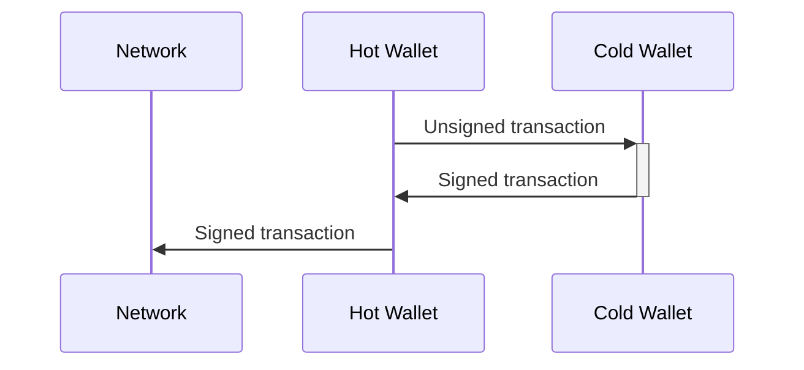

# Signer tutorial

In order to receive and send Bitcoins, a user has to possess a *bitcoin wallet*. Every bitcoin wallet can be managed by anyone who has the *private key* of that wallet. A private key is a 256-bit number that enables the user to manage *all assets* associated with that wallet. 

Every private key can be used for the derivation of thousands of Bitcoin addresses. Bitcoin address is a public piece of information and can be shared   Any asset sent to any of these addresses can be used in new transactions if and only if those transactions are signed by the private key. Therefore, it is of crucial importance for the private key to stay private.

Often, a private key is stored on a personal computer or a server. In those cases, the user can easily manage assets because appropriate software can read those private keys, and crate and sign transactions via private keys. Software that is used for creating and signing transactions and managing private keys is also called  *wallet*.

Storing a private key on a personal computer or server represents a huge security problem because anyone who accesses that computer/server can manage all assets (ie. it can spend all bitcoins). Many viruses and hacker attacks today are trying to find private keys on the compromised device. 

To prevent an attacker from accessing private keys, a type of wallet called a *cold wallet* is used. With the cold wallet, the private key is stored on a device that is offline (cold). When the user wants to sign a transaction, he or she creates an unsigned transaction (via software on the computer that is connected to the internet), transfers the transaction to the cold storage device where that transaction is signed via private key, and then returns signed transaction back to the software from which transaction is broadcasted:

Most cold wallets come in form of USB devices. When the user wants to sign a transaction, the cold wallet is connected to the personal computer. Appropriate software takes care of all communication between the user and the cold wallet, and the user can easily create new transactions. Often, the USB device has physical buttons or a touch screen that enables the user to enter the password. Password is used for encrypting private keys and represents one more layer of security. 

Unfortunately, the moment a cold wallet is connected to a personal computer, it is exposed to threats. Theoretically, an attacker that has access to the desktop could extract the private key from the connected cold wallet (note that by design cold wallet should never expose the private key).

The *Blind signer* project intends to have a cold wallet that can sign transactions without the need to connect the wallet to the host device. The Blind signer project is realized on a device called *USB Armory II*. USB Armory is a computer size of a USB stick. Blind signer project is software intended to be run on USB Armory. The sole purpose of this software is to sign transactions with a private key. Unlike other cold wallets, Blind signer doesn't have to be connected to a personal computer to work. Instead, an unsigned transaction is provided via a single μSD card, and another μSD card is used to transfer the signed transaction from the USB Armory to the device that can broadcast the transaction to the network. In this way, the attack surface is non-existent, but the act of signing the transaction isn't any more convenient as with other solutions (with Blind signer, the whole process of singing can take ~10 minutes, while with other solutions it is a matter of seconds). 

flowchart TB
    UT(Unsigned Tx)
    ST(Signed Tx)
    N((Network))
    UT --> ARM
    ARM --> ST
    ST --> HW
    HW[Hot wallet]
    HW --> UT
    subgraph Secure environment
        direction TB
        ARM{{USB Armory}}
        PK(Seed)
        PS(Password)
        PK --> ARM
        PS --> ARM
    end
    HW <--> N
    style PK fill:#222,color:#fff,stroke-width:0px
    style PS fill:#222,color:#fff,stroke-width:0px
    style UT fill:#222,color:#fff,stroke-width:0px
    style ST fill:#222,color:#fff,stroke-width:0px

## USB Armory II

## Preparation

## Signing
